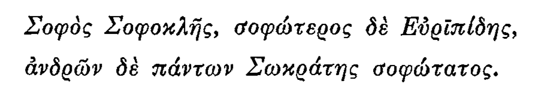

[eumaeus.github.io](https://eumaeus.github.io) : [courses home](index.md)

# Greek 110, Fall 2018

[Course Syllabus](GRK110-Syllabus.md)

## Assignments & Dates 

(Newer assignments will appear at the top of the list.)

- For Monday, October 1: Document the new vocabulary for Unit 2 (p. 53) in your `lexicon.cex` file. Validate frequently!
- For Friday, September 28: Print out to hand in your computer-generated analysis of Exercises 1–10 on p. 36. **Study for a quiz** on the forms of the definite article. It will follow the pattern of the last one.
- For Monday, September 24: Prepare Unit 1 Exercises, on p. 36, numbers 1-10. That is, type them out into a file named "unit1.txt" in `~/Desktop/fall2018vm/ez-morph/documents/`, be able to read them aloud in Greek, and make a first attempt at translating them. **Also**, study for a short quiz on the definite article: given a form, *e.g.* τήν, give its gender, case, and number ("feminine, accusative, singular" for τήν).
- For Friday, September 21: Study the forms of the definite article. The quiz will be on producing the 24 forms, as last time. Try to come to class with Atom up and running, as well as your VM. 
- For Thursday, September 20: Take notes on the Vocabulary for Chapter 1. [Validate with the Virtual Machine.](https://eumaeus.github.io/fall2018vm/). 
- For Tuesday, September 18: [Be able to start, log in to, log out of, and stop the Virtual Machine](https://eumaeus.github.io/fall2018vm/). **Learn the forms of the definite article (p. 28) and be able to write them out, in order, for a quiz.**
- For September 13: Be able to name the five *cases* of Greek, in their conventional order: nominative, genitive, dative, accusative, vocative. Be able to name the three *genders* in Greek: masculine, feminine, neuter. Be able to name the three *numbers*: singular, dual, plural.
- For September 11: In a file named `exercises_1.txt`, type out in Beta-code Unit 1 Exercises, 1-10, on p. 36. Test your typing by pasting each sentence into the [Type Greek](http://folio.furman.edu/type/) webpage. In your file, have the beta-code on one line, followed by a blank line, followed by the Unicode version produced by the web-app:

> `o( *o(/mhros to\n a)/nqrwpon paideu/ei.`
> 
> ὁ Ὅμηρος τὸν ἄνθρωπον παιδεύει.

Do not include the numbers, or any text except a beta-code / unicode pair for each sentence.

- For September 10: Complete Accent Drills I (1-10) and II (1-10) on p. 12 of H&Q. If we have not done so in class, do the following:
	- Go to <https://eumaeus.github.io/fall2018vm/>
	- Follow the instructions under **Setup**. 
- For September 7: Attempt Accent Drills I (1-10) p. 12 of H&Q. 
- For September 6: Windows users: Download and install the [Git for Windows Installer](https://gitforwindows.org/). Mac users: Go to the Mac App Store; download and install XCode. Go to <http://folio.furman.edu/type/> and practice typing Beta Code by typing Pronunciation Exercise IV on p. 12. Print out the Unicode output to hand in for a quiz grade.

	

- For September 4: Do Pronunciation Exercise (b) on p. 15. Be ready to hand this in for a quiz grade on Tuesday. Go to <https://atom.io> and install the Atom text editor.
- For August 31: (1) Know the following, and be able to write an example of each: smooth breathing, rough breathing, acute accent, grave accent, circumflex accent. A quiz will consist of me saying, *e.g.*: "Write the letter alpha with a smooth breathing." You would write "ἀ". (2) Know which characters are *labials*, which are *dentals*, and which are *palatals*. **Bring your computer to class Friday.**
- For August 30: Given the *name* of a Greek letter, be able to write it in upper- and lower-case. Understand the difference between "character/grapheme" and "letterform/glyph". Know what a "diacritical mark" is.

## Topics Covered

- "Dead Language", or, "Closed Production" → "Corpus Linguistics"
- Character, grapheme, letterform, glyph, diacritical mark.
- The Greek Alphabet after 404 BCE.
- Diacritical marks, diphthongs, labials palatals, dentals, and punctuation.
- "Orthography". Modern orthography of ancient Greek.
- Unicode ( 21st Century computational orthography) vs. Beta-code ( 20th Century computational Orthography).
- File System hierarchy. Root directory (`/`). Home Directory (`/Users/YourName` or `~`).
- Accents: acute, grave, circumflex. Recessive Accent. Persistent Accent.

### Topics To Be Covered 

- Inflexion
- Text Editor vs. Word Processor.

## Links

- [A basic introduction to the Unix command line](https://eumaeus.github.io/2018/09/07/cli.html)
- [The `fall2018vm` Virtual Machine image](https://github.com/Eumaeus/fall2018vm). Information [here](https://eumaeus.github.io/fall2018vm/)
- [Type Greek](http://folio.furman.edu/type/): Type beta-code in a web-page; get nice, normalized Unicode that you can copy elsewhere.
- [Sophokeys](http://www.benjaminblonder.org/sophokeys/): A polytonic Greek keyboard for MacOS, based on Beta Code.
- The [POS Tag Generator](http://folio.furman.edu/pos/).
- The [Atom](https://atom.io) text editor.
- The [DejaVu fonts](https://dejavu-fonts.github.io).

## Reflection

The Furman Advantage cites "reflection" as a key component. In this class, "reflection" (which could mean anything), will mean "the ability to talk about what you have done in terms meaningful to people outside of the University".

> Linux is the operating system that hosts the information economy. Scientific research projects, the rendering of animated films, banking, manufacturing processes all tend to run on Linux because it is powerful, capable, and free to use and customize. As you work on Classics at Furman University, you will gain basic (and some not-so-basic) skills with Linux. **A basic knowledge of Linux is a marketable skill.** At the end of this course, you can add to your resumé: "Experience working with Linux (Ubuntu server, v.14) in a virtualized environment."
